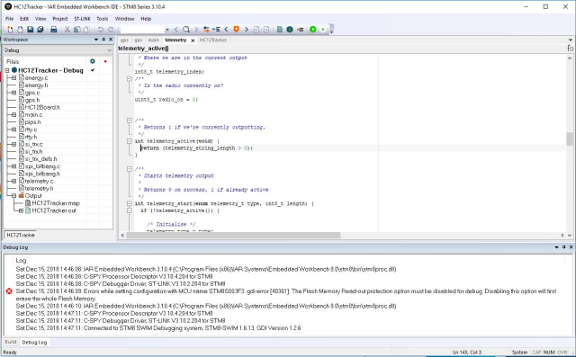

# Code Development, Programming and Debugging the HC12 Radio Module

How to develop code, program, and debug the embedded STM8S003F3 processor on the HC12 radio module.

## Code Development

We use IAR Embedded Workbench for STM8. This is a professional development environment. IAR offers a limited code-size version supporting up to 8K, which matches the STM8S003F3 flash size used by this project.

* The 8K code-size limit is the same as the code size on the STM8S003F3.
* The source of the libraries is not provided, but we do not use them.
* It is available for Microsoft Windows.
* We do not use the code for commercial purposes.

Download the evaluation version and obtain a license for the free 8K code-limited version.

If these limitations are an issue, other compilers are available, such as [SDCC](http://sdcc.sourceforge.net/).

## Programming and Debugging

To program the STM8S003F3 flash, we use the [ST-LINK/V2](https://www.st.com/en/development-tools/st-link-v2.html) or one of the low-cost clones available. The clones we have tested work well.

The ST-LINK/V2 is wired to the HC12 using the GND, RST, SWIM, and 3.3V/VCC connections. The VCC connection powers the HC12 from the clone. The SWIM and RST pads are adjacent to the TXD and RXD pads on the rear of the PCB.

The HC12 as purchased comes with custom code that is Read Out Protected (ROP). This must be disabled by erasing the flash of the STM8S003F3. This is done using the Option Bytes selection from the IAR Embedded Workbench ST-LINK menu.

