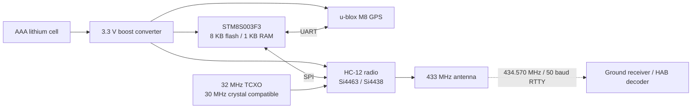
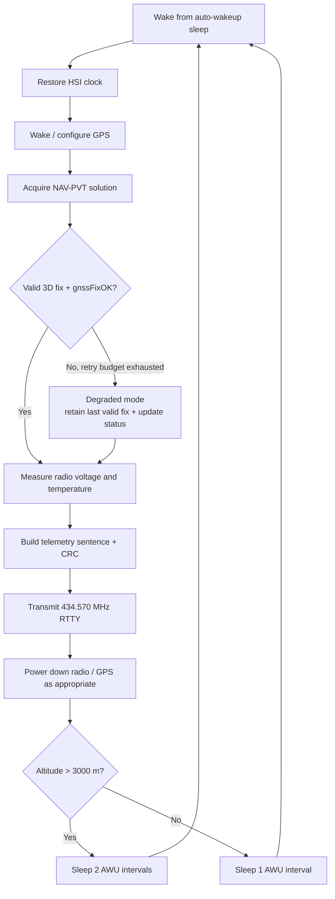
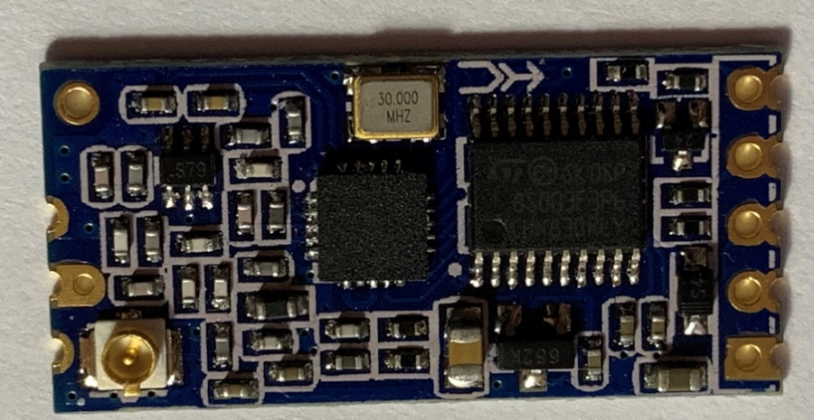
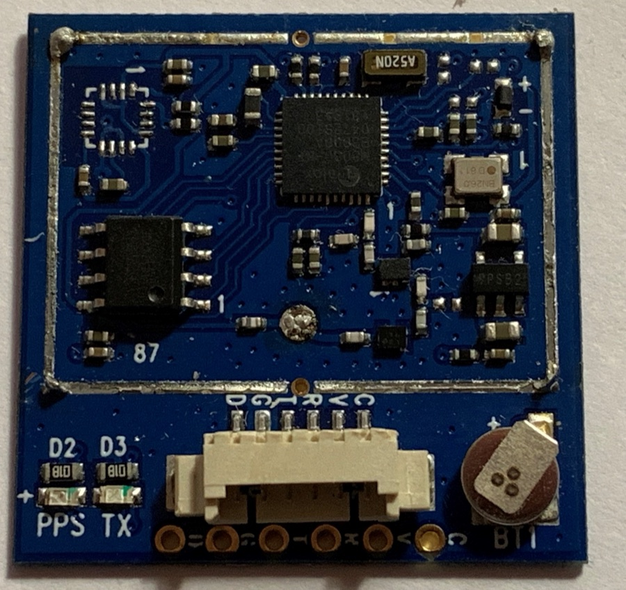
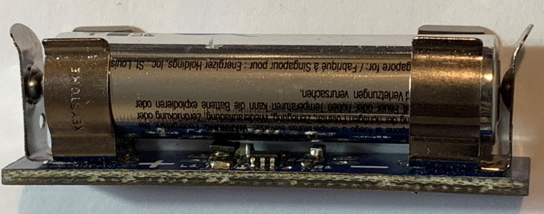

# PicoTracker

[](https://github.com/ImperialSpaceSociety/PicoTracker/releases/latest)
[](https://github.com/ImperialSpaceSociety/PicoTracker/actions/workflows/host-tests.yml)
[](firmware/)
[](LICENSES/MIT.txt)
[](LICENSES/CERN-OHL-1.2.txt)

PicoTracker is a lightweight, low-cost high-altitude balloon tracking platform built around an STM8 microcontroller, HC-12 radio hardware, u-blox GPS, and 433 MHz RTTY telemetry. The project was originally developed by the Imperial College Space Society and returned to active maintenance in 2026.

### Project status

[`v1.4.0`](https://github.com/ImperialSpaceSociety/PicoTracker/releases/tag/v1.4.0) is the current maintained release. It is a source-only release focused on firmware correctness, bounded failure handling, regression testing, STM8 size verification, and clearer project documentation. The original hardware dates from 2018-2019, so current builders should still revalidate component availability, RF configuration, power behaviour, and environmental assumptions.

### Maintainer

This repository is maintained and administered by [Sylvester Kaczmarek](https://SylvesterKaczmarek.com). Maintenance questions, technical changes, release coordination, and collaboration proposals can be raised through GitHub issues or directed to the maintainer through the website.

<p align="center">
  
</p>
<p align="center"><sub>High-altitude view from one of the project balloon flights.</sub></p>

## Start here

New to PicoTracker? You can get a meaningful first result without any hardware:

```sh
git clone https://github.com/ImperialSpaceSociety/PicoTracker.git
cd PicoTracker
make demo
make test
```

`make demo` decodes the included real telemetry capture, which currently contains **165 valid frames**; `make test` runs the complete host regression suite. The root `Makefile` is the canonical developer entry point:

| Command | Purpose |
| --- | --- |
| `make` / `make help` | Show the available developer commands |
| `make demo` | Decode the included flight capture; no C compiler or hardware required |
| `make simulate` | Run a synthetic end-to-end tracker flight cycle with optional fault injection |
| `make test` | Run all host regression tests |
| `make decode` | Decode a telemetry capture; override with `CAPTURE=path/to/file` |
| `make stm8` | Run the structural STM8 compile/link check; requires SDCC |
| `make quality` | Run C static analysis, Python lint/format checks, and whitespace validation |
| `make format` | Apply Ruff fixes and Python formatting |
| `make release-check` | Validate `VERSION` and `CHANGELOG.md` for `RELEASE_TAG` |
| `make release-notes` | Preview generated notes for `RELEASE_TAG` |
| `make check` | Run quality checks, tests, decoding, simulator, and STM8 verification |
| `make clean` | Remove generated host-test output |
| `make container-build` | Build the reproducible Linux development image |
| `make container-check` | Run the full verification suite inside that image |

For a reproducible Linux toolchain with Python, GCC, Make, SDCC, cppcheck, and Ruff already installed, use the [Dev Container / Docker environment](docs/development-environment.md).

From there, [`docs/getting-started.md`](docs/getting-started.md) gives separate paths into firmware, GPS/UBX, radio/telemetry, Python tooling, testing, hardware, CAD, and documentation. If you want one guided end-to-end exercise first, follow the [`first-project tutorial`](docs/first-project.md). See [`docs/roadmap.md`](docs/roadmap.md) for extension ideas ranging from small first contributions to larger hardware and tooling projects.

## Why work on PicoTracker

PicoTracker is unusual in that one small repository spans almost the complete path from a battery-powered embedded device to received, decoded flight telemetry. You can work on constrained C firmware, GPS protocols, RF control, power management, telemetry, Python tooling, tests, hardware, or CAD and still see how your change fits into the whole system.

The STM8 target has only **8 KB of flash and 1 KB of RAM**, so engineering trade-offs are visible rather than hidden behind abundant resources. At the same time, the repository contains historical flight hardware, launch footage, and real captured telemetry, while the maintained codebase now has regression tests and reproducible structural checks. That combination makes it useful both as a learning platform and as a base for serious improvements in tooling, hardware accessibility, power, validation, and ground-side analysis.

## At a glance

| Item | Current project configuration |
| --- | --- |
| MCU | STM8S003F3, 8 KB flash, 1 KB RAM |
| Radio | HC-12 hardware using Si4463 or compatible Si4438 paths |
| Default RF frequency | 434.570 MHz |
| Telemetry | 50 baud RTTY with XMODEM CRC |
| GPS | u-blox M8 family |
| Radio oscillator | 32 MHz TCXO by default; 30 MHz crystal compatibility retained |
| Processor clock | 16 MHz internal HSI |
| Power | AAA lithium primary cell with 3.3 V boost stage in the original design |
| Current release | [`v1.4.0`](https://github.com/ImperialSpaceSociety/PicoTracker/releases/tag/v1.4.0) |
| Production project | [`firmware/HC12Tracker.ewp`](firmware/HC12Tracker.ewp) |

## System architecture



The STM8 runs from its 16 MHz internal HSI clock. The separate 32 MHz TCXO shown above is the maintained default oscillator for the Si4463 radio; the original 30 MHz crystal path is retained as a compatibility configuration.

## What changed in v1.4.0

`v1.4.0` is the first maintained release following the 2026 firmware and repository hardening work. Major changes include:

- strict UBX payload length, checksum, ACK/NAK, and valid-3D-fix handling
- bounded GPS, UART, STM8 clock-switch, and Si4463 command waits
- corrected Si4463 reset and `POWER_UP` sequencing with explicit error propagation
- corrected telemetry frame sizing, numeric formatting, temperature handling, and operational-status reporting
- preserved last-known valid GPS data when acquisition enters degraded mode
- restored and tested altitude-dependent sleep/wake behaviour and HSI clock recovery
- removed floating-point radio synthesizer arithmetic and reduced firmware footprint for the 8 KB STM8 target
- added host regression tests, telemetry decoder tests, repository metadata checks, and a repeatable STM8 structural compile/link check

See [`CHANGELOG.md`](CHANGELOG.md) for the detailed release history.

## How the tracker operates

A normal cycle acquires and validates a u-blox NAV-PVT solution, reads radio voltage and temperature, constructs a CRC-protected telemetry sentence, transmits it over 433 MHz RTTY, powers down the radio and GPS as appropriate, and enters STM8 auto-wakeup sleep. GPS acquisition and radio command paths are bounded so loss of GPS or a radio CTS failure does not create an intentional infinite wait. If a new valid GPS solution cannot be obtained, the tracker continues in degraded mode while retaining the most recently accepted fix.

At altitudes up to 3000 m the maintained firmware uses one auto-wakeup sleep interval. Above 3000 m it uses two intervals before returning to the HSI clock and beginning the next acquisition/transmit cycle.

You can exercise this state machine without hardware using `make simulate`. The [hardware-independent simulator](docs/simulator.md) supports GPS-loss, measurement-failure, and radio-transmit fault injection and can generate decoder-compatible synthetic telemetry captures.



## Configuration

The main flight configuration is intentionally concentrated in a small number of files:

| Setting | Default | Location |
| --- | --- | --- |
| Payload name | `ICSPACE14` | [`firmware/main.h`](firmware/main.h) |
| RF frequency | `434570000` Hz | [`firmware/main.h`](firmware/main.h) |
| RTTY timing | 50 baud configuration | [`firmware/main.h`](firmware/main.h) |
| Radio oscillator | 32 MHz TCXO | [`firmware/HC12Board.h`](firmware/HC12Board.h) |
| 30 MHz crystal compatibility | Supported by removing `XO_TCXO` | [`firmware/HC12Board.h`](firmware/HC12Board.h) |
| Sleep cadence | 1 interval through 3000 m, 2 above | [`firmware/sleep_policy.h`](firmware/sleep_policy.h) |

Review these settings before programming hardware for a new payload or flight. RF frequency, output power, antenna configuration, and balloon operation must also comply with the applicable local requirements.

## Verification and testing

GitHub Actions runs the full reproducible `make check` gate on pushes to `master` and on pull requests. It includes cppcheck for maintained C, Ruff lint/format verification, maintained-tree whitespace validation, the host regression suite, telemetry decoding, the simulator smoke run, repository metadata checks, and the STM8 structural target check.

For `v1.4.0`, the CI SDCC 4.2 structural build used **7,787 / 8,192 bytes** of flash span and **130 / 1,024 bytes** of static DATA. The structural SDCC build uses compatibility shims for IAR-specific registers and interrupt declarations, so it is a target-compiler and memory-window check, not a flashable firmware artifact. The release was approved by the maintainer following target/hardware validation; detailed native-IAR logs and quantitative hardware measurements were not archived with that release.

The root `Makefile` keeps verification commands consistent across local development and CI. Run the fast static gate with `make quality`, the host suite with `make test`, the independent target-structure check with `make stm8`, and the telemetry smoke test with `make decode`. With the development tools installed, the complete repository verification is one command:

```sh
make check
```

The maintained production project for native STM8 development is [`firmware/HC12Tracker.ewp`](firmware/HC12Tracker.ewp). See [`docs/code-quality.md`](docs/code-quality.md) for the quality gate and [`docs/development.md`](docs/development.md) for programming and debugging notes.

Future releases use the tag-driven [`Release` workflow](docs/release-automation.md): an annotated `vX.Y.Z` tag must match `VERSION` and `CHANGELOG.md`, the full reproducible checks must pass, and only then is the GitHub Release created.

## Telemetry

PicoTracker transmits a comma-separated RTTY sentence containing the payload name, sentence ID, UTC time, signed latitude and longitude, altitude, satellite count, radio supply voltage, packed operational status, radio temperature, and a four-digit XMODEM CRC.

```text
PAYLOAD,ID,HHMMSS,+LAT,-LON,ALT,SATS,VOLTAGE,STATUS,+TEMP*CRC
```

The exact field order is documented in [`docs/telemetry-format.md`](docs/telemetry-format.md). The packed status field, including GPS acquisition and measurement failure information, is documented in [`docs/status-word.md`](docs/status-word.md).

## Repository layout

| Path | Purpose |
| --- | --- |
| [`firmware/`](firmware/) | Maintained STM8 tracker firmware and IAR project |
| [`tests/`](tests/) | Host regression tests and STM8 structural target check |
| [`tools/`](tools/) | Telemetry decoder and sample captured data |
| [`hardware/`](hardware/) | Historical hardware design and reference files |
| [`cad/`](cad/) | Mechanical and printable tracker parts |
| [`docs/`](docs/) | Development, GPS, radio, telemetry, release, and validation documentation |
| [`test_firmware/`](test_firmware/) | Historical diagnostic firmware, retained for reference and not release-qualified |

## Documentation

- [`docs/development.md`](docs/development.md) - development, programming, debugging, oscillator configuration, and runtime notes
- [`docs/code-quality.md`](docs/code-quality.md) - static analysis, Python lint/format, and whitespace quality gates
- [`docs/gps.md`](docs/gps.md) - GPS hardware and integration notes
- [`docs/hc12.md`](docs/hc12.md) - HC-12, Si4463/Si4438, oscillator, and processor notes
- [`docs/telemetry-format.md`](docs/telemetry-format.md) - telemetry field order
- [`docs/status-word.md`](docs/status-word.md) - operational-status bit layout
- [`tests/README.md`](tests/README.md) - regression and structural target-test scope
- [`docs/release-checklist.md`](docs/release-checklist.md) - release process
- [`docs/hardware-validation.md`](docs/hardware-validation.md) - target/hardware validation record
- [`CHANGELOG.md`](CHANGELOG.md) - release history

## Project hardware

The repository retains photographs of the original project hardware. These are useful references for identifying the major modules, although current builders should verify the exact revision and components they source.

<table>
  <tr>
    <td align="center"><br><sub>HC-12 radio / STM8 module</sub></td>
    <td align="center"><br><sub>u-blox GPS module</sub></td>
    <td align="center"><br><sub>AAA battery boost converter</sub></td>
  </tr>
</table>

## Flight footage

The project has a larger video archive documenting high-altitude balloon flights from launch through ascent, the edge-of-space phase, and descent. The selected clips below are from [Sylvester Kaczmarek's YouTube channel](https://www.youtube.com/@SylvesterKaczmarek) and give a quick visual sense of the environment PicoTracker was built to operate in.

<table>
  <tr>
    <td width="33%" align="center">
      <a href="https://www.youtube.com/watch?v=IWZ5Tttl32g"></a><br>
      <strong>Ascent</strong><br>
      <sub><a href="https://www.youtube.com/watch?v=IWZ5Tttl32g">High Altitude Balloon 2018: 08 Raising</a></sub>
    </td>
    <td width="33%" align="center">
      <a href="https://www.youtube.com/watch?v=OtdXHd_AjtY"></a><br>
      <strong>Edge of space</strong><br>
      <sub><a href="https://www.youtube.com/watch?v=OtdXHd_AjtY">High Altitude Balloon 2018: 20 The Edge of Space</a></sub>
    </td>
    <td width="33%" align="center">
      <a href="https://www.youtube.com/watch?v=-n3UuoJTzKg"></a><br>
      <strong>Descent and landing</strong><br>
      <sub><a href="https://www.youtube.com/watch?v=-n3UuoJTzKg">High Altitude Balloon 2018: 34 Landing</a></sub>
    </td>
  </tr>
</table>

More flight footage: [Raising 03](https://www.youtube.com/watch?v=nnN85UmlgXM) · [Edge of Space 11](https://www.youtube.com/watch?v=IkWxLzXfyp0) · [Edge of Space 19](https://www.youtube.com/watch?v=CTOZ2g5Ok2o) · **[watch the full High Altitude Balloon 2018 playlist](https://www.youtube.com/playlist?list=PLf9MwNhV-GcEE7K-Lzd70tIrfB1l1Xk7f)**.

## Hardware design

### GPS

The original design uses a u-blox M8-based GPS module suitable for high-altitude balloon operation. Historical modules incorporated the receiver, TCXO, backup supply, external flash, LNA, SAW filtering, and a ceramic antenna. The original lightweight build concept removed the metal shield and ceramic antenna and replaced the antenna with a wire element and ground plane. Historical mass varied significantly with module and antenna configuration.

### 433 MHz radio and processor

The tracker reprograms the STM8S003F3 processor already present on HC-12 radio hardware and drives the Si4463 directly. The maintained firmware also retains the historical Si4438-compatible detection path. The STM8S003F3 has 8 KB of flash and 1 KB of RAM, making code size and bounded resource use important design constraints.

### Battery

The original battery supply is based on the earlier [BatteryAAA](https://github.com/ribbotson/rlabTelemetryTx/tree/master/Hardware/BatteryAAA) design, using a AAA lithium primary cell and a boost converter to supply approximately 3.3 V to the GPS, radio, and processor. Historical measurements were approximately 8 g for the cell and 3.5 g for the holder and boost converter.

### Tracker body

The tracker body can be 3D printed or made from lightweight foam. The original antenna arrangement placed the GPS antenna at the top and the 433 MHz radio antenna at the bottom. Mechanical files are retained in [`cad/`](cad/).

## Design constraints

PicoTracker is intentionally small and resource-constrained. The main engineering constraints are the 8 KB STM8 flash limit, low-temperature operation, oscillator stability, RF configuration, GPS availability at altitude, and energy consumption during acquisition/transmit/sleep cycles. The original modules and mechanical design were developed in 2018-2019, so a new physical build should be treated as a revalidation of the historical hardware rather than an assumption that every original component or measured property is unchanged.

## Release history

| Release | Date | Status |
| --- | --- | --- |
| [`v1.4.0`](https://github.com/ImperialSpaceSociety/PicoTracker/releases/tag/v1.4.0) | 2026-09-13 | Current maintained release |
| [`v1.3`](https://github.com/ImperialSpaceSociety/PicoTracker/releases/tag/v1.3) | 2019-03-07 | Historical, superseded by v1.4.0 |

## Contributing

Focused firmware fixes, regression tests, decoder/tooling improvements, documentation, hardware validation notes, and well-scoped technical contributions are welcome. New contributors should begin with [`docs/getting-started.md`](docs/getting-started.md), then see [`CONTRIBUTING.md`](CONTRIBUTING.md) before opening a pull request. Project conduct, support, and security reporting are covered by [`CODE_OF_CONDUCT.md`](CODE_OF_CONDUCT.md), [`SUPPORT.md`](SUPPORT.md), and [`SECURITY.md`](SECURITY.md).

## License

PicoTracker uses separate licenses for software and hardware design material:

- Software and firmware: [MIT License](LICENSES/MIT.txt).
- Hardware design documentation: [CERN Open Hardware Licence v1.2](LICENSES/CERN-OHL-1.2.txt), or a later version where the existing project notice permits it.

See [`LICENSE.md`](LICENSE.md) for the repository license split and applicable notices.
